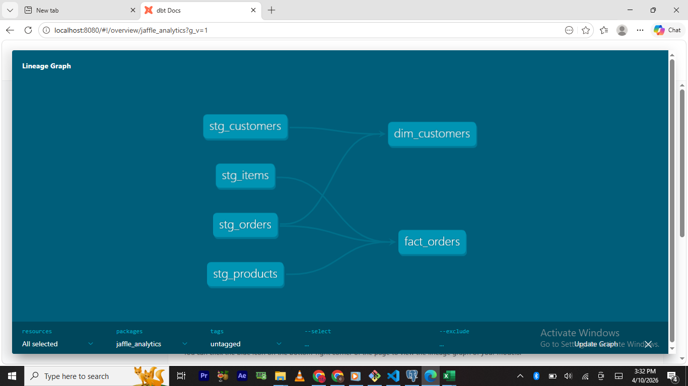

# 🥐 Jaffle Shop Analytics: dbt & Postgres Pipeline

This project transforms raw transactional data into a curated analytics layer. It demonstrates a modern data engineering workflow using **dbt (data build tool)** and **PostgreSQL**.

## 📊 Project Overview
The goal was to transform four raw data tables into a Star Schema that provides insights into customer behavior and order performance.

### Data Lineage
This graph represents the flow of data from the raw staging area to the final business models.


## 🏗️ Architecture
The project is organized into two primary layers:

1. **Staging Layer (`models/staging/`):**
   - Cleaned column names (e.g., `id` to `customer_id`).
   - Standardized data types.
   - Performed basic calculations.

2. **Mart Layer (`models/marts/`):**
   - **`dim_customers`**: Aggregates customer data to show Lifetime Value (LTV) and order history.
   - **`fact_orders`**: Joins orders, items, and products to calculate revenue and tax metrics.

## 🚀 Technical Skills Demonstrated
* **Modular SQL:** Using Common Table Expressions (CTEs) for readability.
* **Dependency Management:** Using the `{{ ref() }}` function to build a dynamic DAG.
* **Documentation:** Auto-generated dbt documentation and lineage graphs.
* **Data Modeling:** Implementation of Dimension and Fact tables.

## 🛠️ How to Setup
1. Clone the repo.
2. Ensure you have dbt installed (`pip install dbt-postgres`).
3. Configure your `profiles.yml` to point to your Postgres instance.
4. Run the models:
   ```bash
   dbt run
   ```
   
## ✉️ Contact & Connect
If you have any questions about this project or want to chat about Data Engineering, feel free to reach out!

 **Favour Peter James** 
* **Portfolio** [https://peterjames2019.github.io/]
* **LinkedIn:** [https://linkedin.com/in/favour-peter-43b330263]
* **GitHub:** [https://github.com/peterjames2019]
